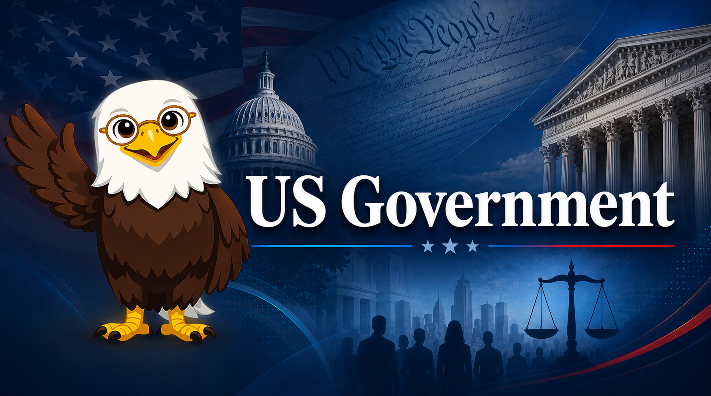

# US Government

Welcome to **US Government**, an interactive intelligent textbook for high school students preparing for the AP US Government and Politics exam.

<figure markdown>
  { width="100%" }
</figure>

## About This Book

This textbook provides a rigorous, college-level examination of the structure, functions, and evolution of the United States government. Students explore the philosophical foundations of American democracy, the three branches of the federal government, federalism, and constitutional protections for civil liberties and civil rights.

Four cross-cutting skills are woven throughout every chapter: **critical thinking**, **systems thinking**, **cognitive bias awareness**, and **misinformation detection** — including a dedicated final chapter on the rapidly growing impact of artificial intelligence on government.

## Who This Book Is For

- High school students in grades 9–12 preparing for the AP US Government and Politics exam
- Homeschool students seeking a rigorous civics curriculum
- Teachers looking for interactive, standards-aligned instructional materials
- Anyone interested in how American government actually works

No prerequisites required beyond reading at or above grade level.

## How to Use This Book

Use the navigation sidebar to explore:

- **Chapters** — Twelve structured chapters aligned to the AP curriculum
- **Learning Graph** — Interactive visualization of how concepts connect
- **MicroSims** — Hands-on interactive simulations for key concepts
- **Glossary** — Definitions for core political science terms
- **Quizzes** — Self-assessment questions for each chapter

## Chapters at a Glance

| # | Chapter | Key Topics |
|---|---------|------------|
| 1 | [Foundations of American Democracy](chapters/01-foundations-of-democracy/index.md) | Natural rights, Articles of Confederation, Constitutional Convention |
| 2 | [The Constitution and Bill of Rights](chapters/02-constitution-and-bill-of-rights/index.md) | Constitutional structure, amendments, judicial interpretation |
| 3 | [Federalism and Federal Powers](chapters/03-federalism-and-federal-powers/index.md) | Division of power, evolution of federalism, grants |
| 4 | [Congress: Structure and Processes](chapters/04-congress-structure-and-processes/index.md) | House, Senate, legislative process, oversight |
| 5 | [The Presidency](chapters/05-the-presidency/index.md) | Constitutional powers, executive orders, war powers |
| 6 | [The Federal Bureaucracy](chapters/06-the-federal-bureaucracy/index.md) | Executive agencies, rulemaking, accountability |
| 7 | [The Federal Judiciary](chapters/07-the-federal-judiciary/index.md) | Federal courts, Supreme Court, judicial review |
| 8 | [Civil Liberties and Civil Rights](chapters/08-civil-liberties-and-civil-rights/index.md) | First–Eighth Amendments, equal protection, landmark cases |
| 9 | [Political Opinion, Media, and Civic Reasoning](chapters/09-political-opinion-media-and-civic-reasoning/index.md) | Public opinion, media, polarization, bias |
| 10 | [Voting, Political Parties, and Participation](chapters/10-voting-political-parties-and-participation/index.md) | Voting behavior, parties, turnout |
| 11 | [Interest Groups, Campaigns, and Elections](chapters/11-interest-groups-campaigns-and-elections/index.md) | PACs, campaign finance, Electoral College |
| 12 | [The Impact of AI on Government](chapters/12-impact-of-ai-on-government/index.md) | Algorithmic decision-making, AI regulation, deepfakes |

## Getting Started

Start with [Chapter 1: Foundations of American Democracy](chapters/01-foundations-of-democracy/index.md) to begin your journey — or jump directly to any topic using the sidebar.

!!! mascot-welcome "Welcome, Future Citizen!"
    
    I'm **Lex**, your guide through the laws and institutions that shape American democracy. "The law belongs to all of us!" — so let's explore it together, citizens!
