# List of MicroSims

Interactive Micro Simulations to help students learn AP US Government and Politics fundamentals.

-   **[AI Threat Taxonomy for Elections](./ai-election-threats-map/index.md)**

    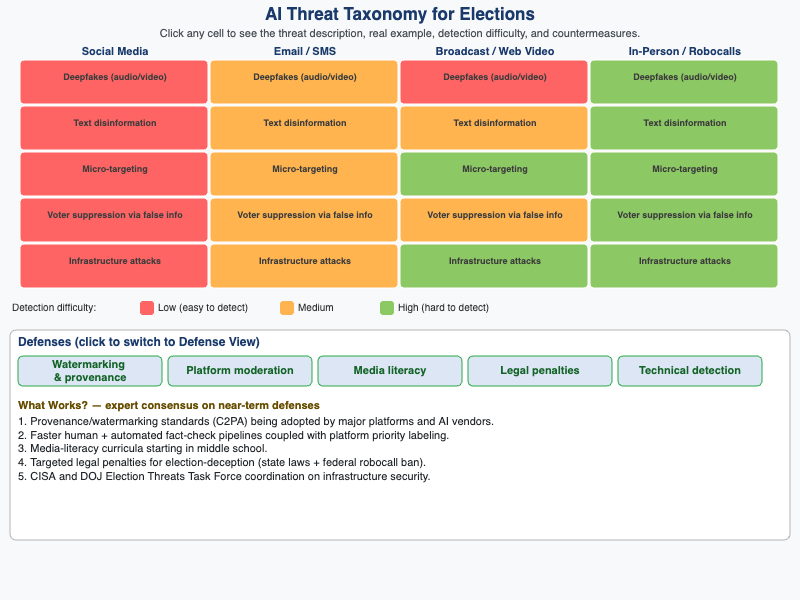

    Interactive risk map where students classify AI-enabled election threats and evaluate the effectiveness of proposed countermeasures.

-   **[Causal Loop Diagram Viewer](./cld-viewer/index.md)**

    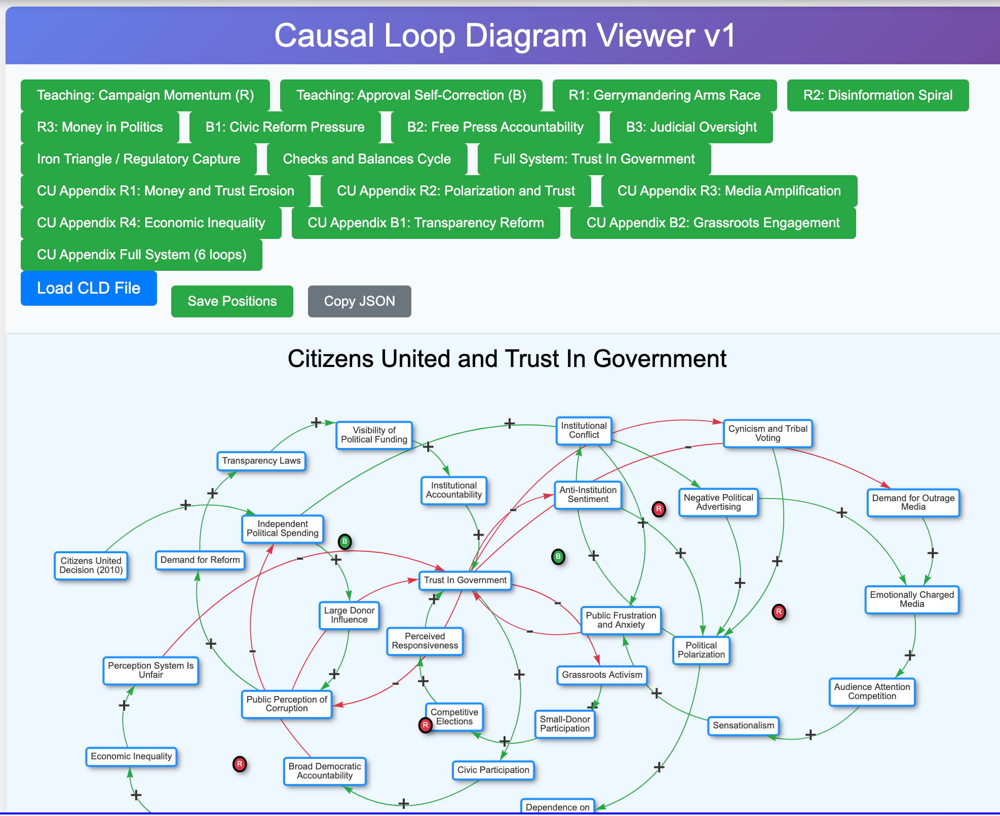
    A shared fullscreen viewer for browsing and editing the causal loop diagrams used across this textbook. Load any CLD file, drag nodes to reposition them, and explore feedback loops.

-   **[Checks and Balances Among the Three Branches](./checks-and-balances-diagram/index.md)**

    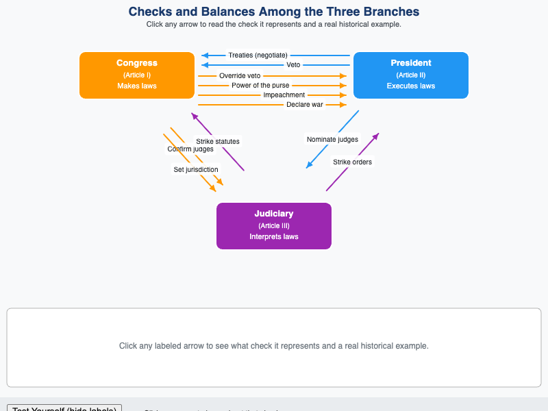

    Identifies each constitutional check and explains how it prevents any single branch from accumulating too much power.

-   **[Civil Rights Milestones — Legal and Legislative Timeline](./civil-rights-timeline/index.md)**

    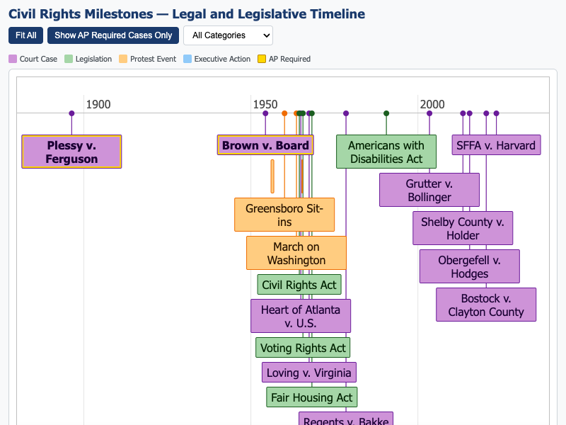

    Chronological timeline of major civil rights milestones showing how legal decisions and legislation built upon each other.

-   **[Cognitive Bias in Political Reasoning](./cognitive-bias-identifier/index.md)**

    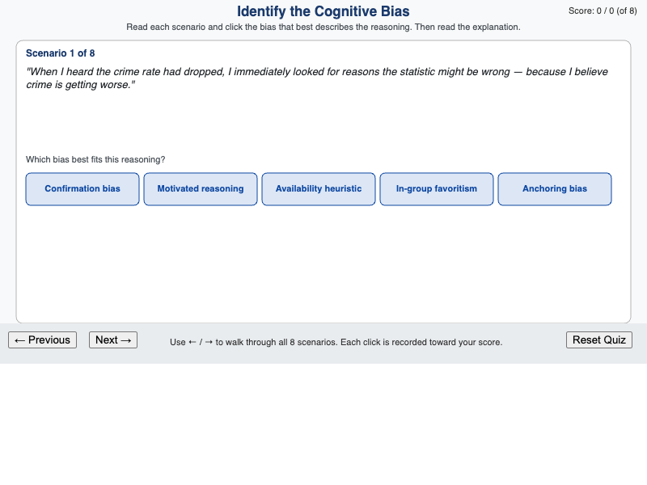

    Scenario-based explorer where students classify political reasoning examples as confirmation bias, motivated reasoning, availability heuristic, in-group favoritism, or anchoring.

-   **[Constitutional Amendment Timeline](./constitutional-amendments-timeline/index.md)**

    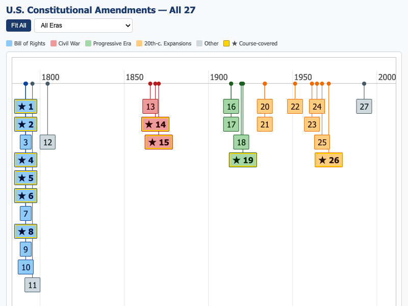

    Interactive timeline identifying constitutional amendments and the historical context that drove each ratification.

-   **[Corruption Perceptions Index — Western Democracies](./corruption-perception-rankings/index.md)**

    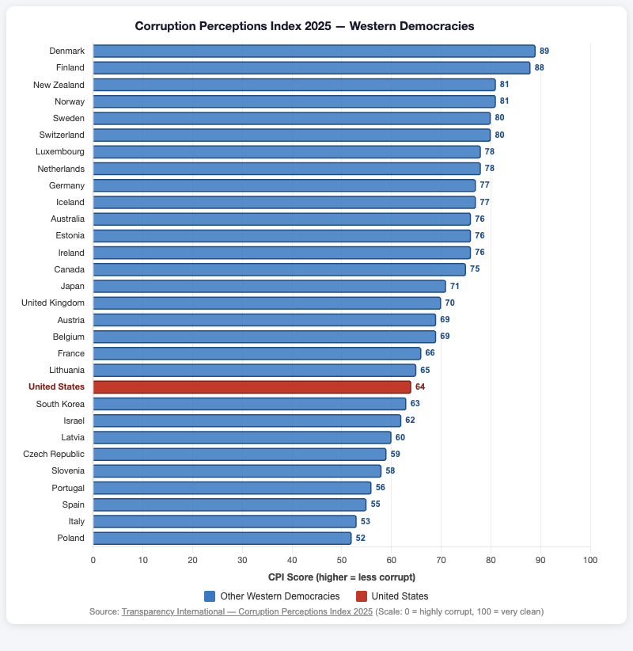

    Horizontal bar chart comparing Corruption Perceptions Index scores across 30 Western democracies, with the United States highlighted.

-   **[Electoral College — Interactive Map](./electoral-college-map/index.md)**

    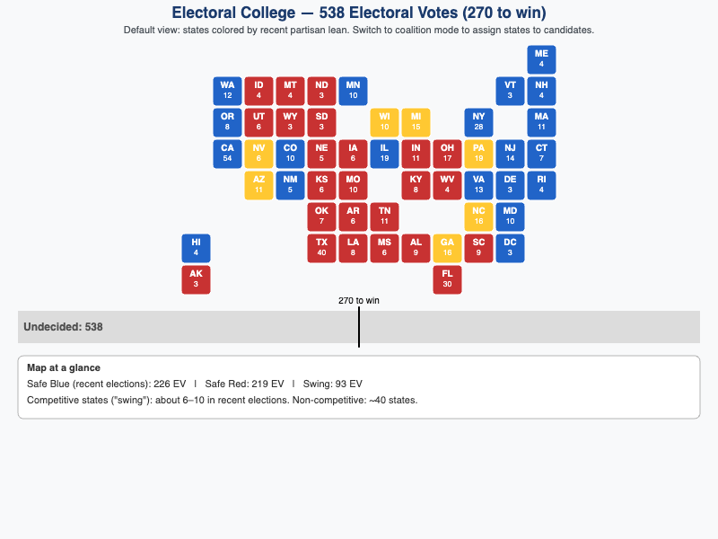

    Interactive map explaining how the Electoral College works and how winner-take-all rules concentrate campaign attention in swing states.

-   **[Enlightenment Ideas to American Institutions](./enlightenment-to-constitution-timeline/index.md)**

    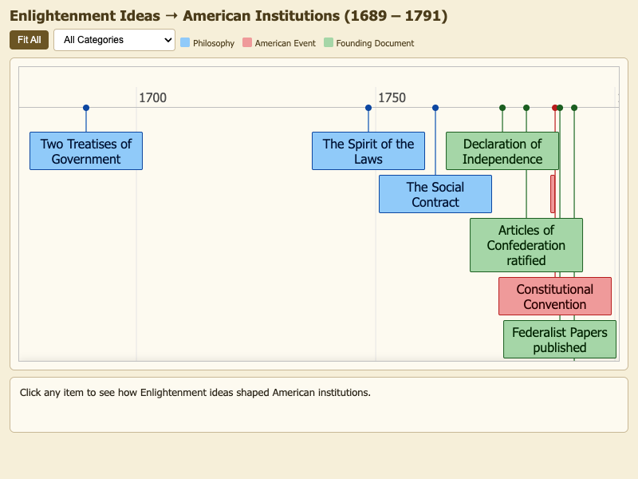

    Connects key Enlightenment thinkers to the specific founding documents and constitutional structures they influenced.

-   **[Federalism Evolution — From Dual to Cooperative to New](./federalism-evolution-timeline/index.md)**

    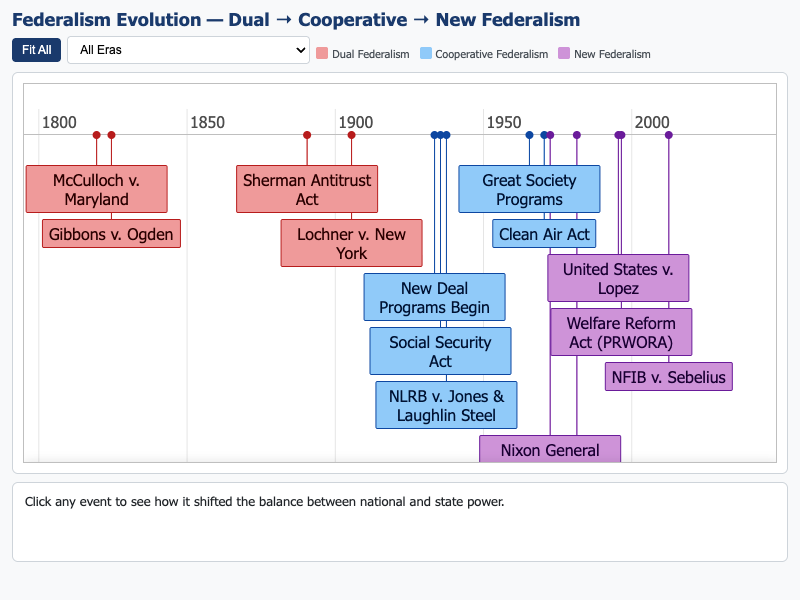

    Timeline showing how the balance of power between national and state governments has shifted across historical eras and what drove those changes.

-   **[Gerrymandering — Packing and Cracking Visualized](./gerrymandering-microsim/index.md)**

    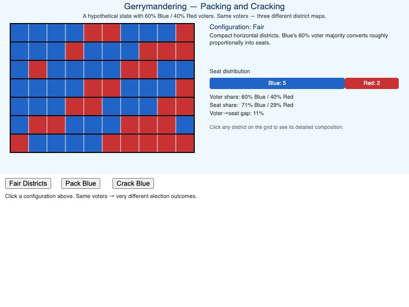

    Grid-based visualization demonstrating how district boundary drawing affects election outcomes through packing and cracking strategies.

-   **[Government Trust Trend (1958–2025)](./government-trust-trend/index.md)**

    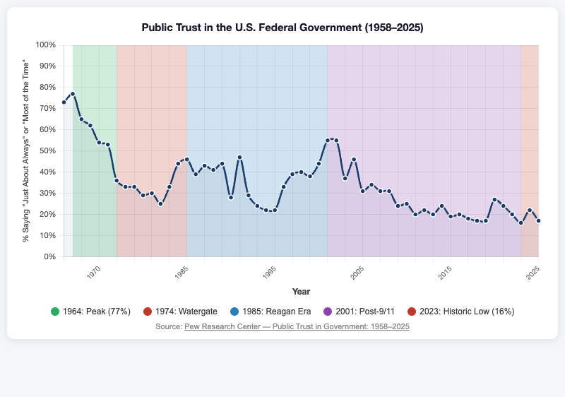

    Interactive line chart showing how public trust in the U.S. federal government has changed from 1958 to 2025 based on Pew Research Center data.

-   **[Great Compromise — The Two-Chamber Solution](./great-compromise-representation/index.md)**

    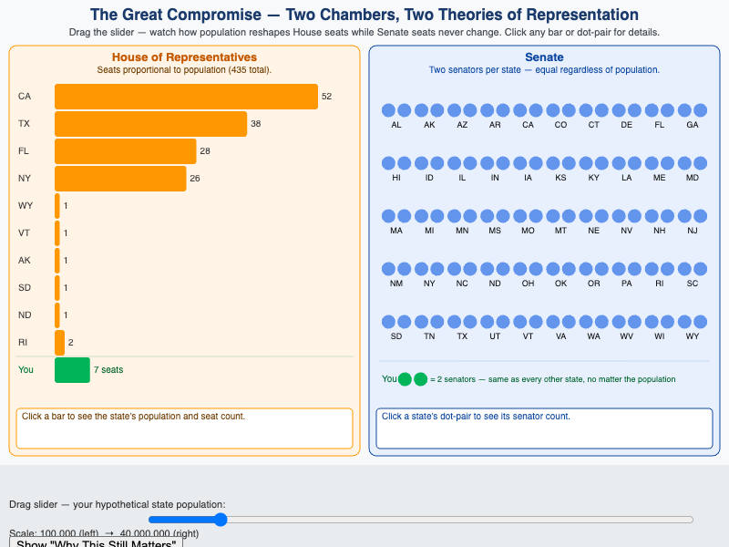

    Explains how the Great Compromise resolved the conflict between large-state and small-state interests by creating a bicameral legislature.

-   **[How a Bill Becomes a Law](./bill-to-law-flowchart/index.md)**

    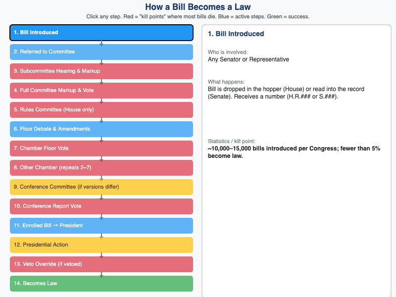

    Step-by-step flowchart of the legislative process from introduction through presidential action and possible veto override.

-   **[Iron Triangle vs. Issue Network — Structural Comparison](./iron-triangle-vs-issue-network/index.md)**

    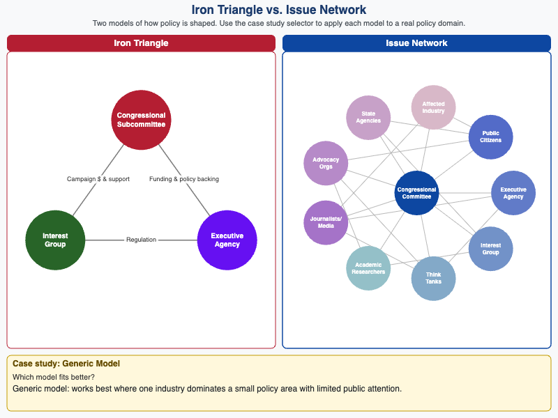

    Structural comparison of iron triangle and issue network models of policy influence applied to contemporary policy domains.

-   **[Learning Graph Viewer](./graph-viewer/index.md)**

    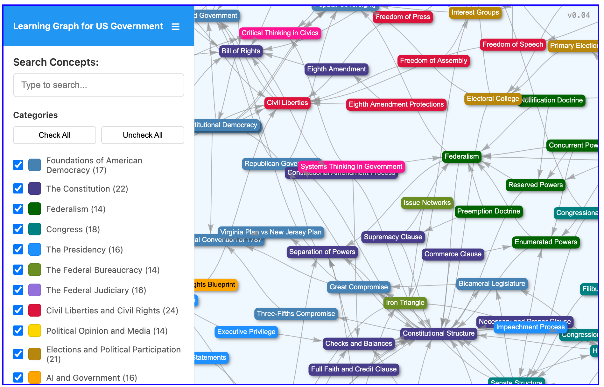

    View the concepts for this course as a directed graph with links showing dependencies between topics.

-   **[Powers Comparison — Articles vs. Constitution](./articles-vs-constitution-powers/index.md)**

    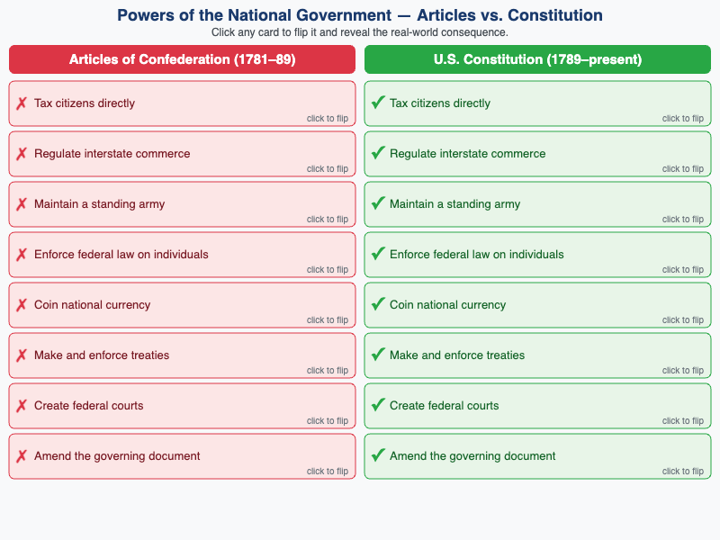

    Side-by-side comparison of the powers granted to the national government under the Articles of Confederation versus the Constitution.

-   **[Presidential Power — Formal vs. Informal Sources](./presidential-power-categorizer/index.md)**

    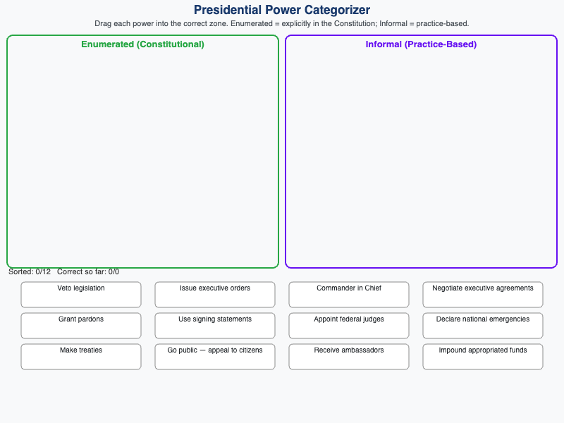

    Classify presidential powers as enumerated (constitutional) or informal (practice-based) and apply the distinction to novel scenarios.

-   **[Spoils System vs. Merit System](./spoils-to-merit-timeline/index.md)**

    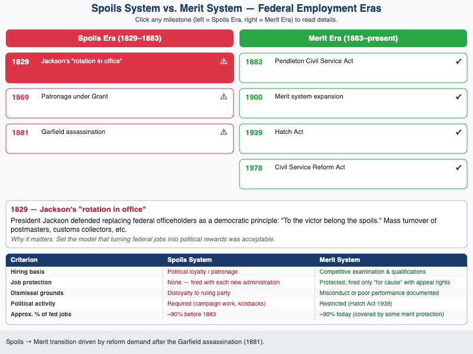

    Timeline comparing the spoils and merit systems of federal employment and explaining why the Pendleton Act transition occurred.

-   **[The Grants Spectrum — Categorical to Block](./grants-spectrum-slider/index.md)**

    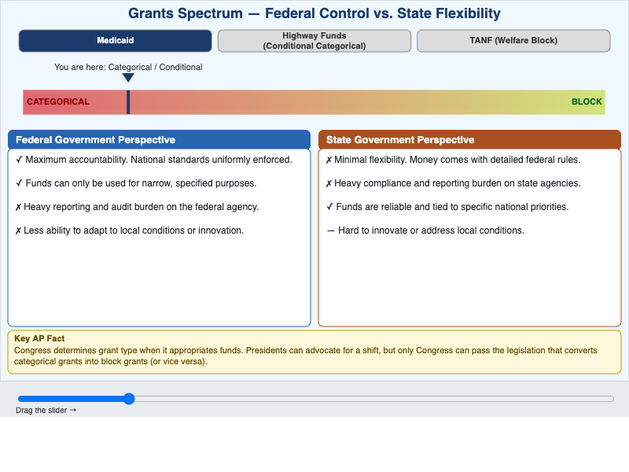

    Interactive slider contrasting categorical and block grants, exploring trade-offs between federal accountability and state flexibility.

-   **[Three-Tier Federal Court Hierarchy](./federal-court-hierarchy/index.md)**

    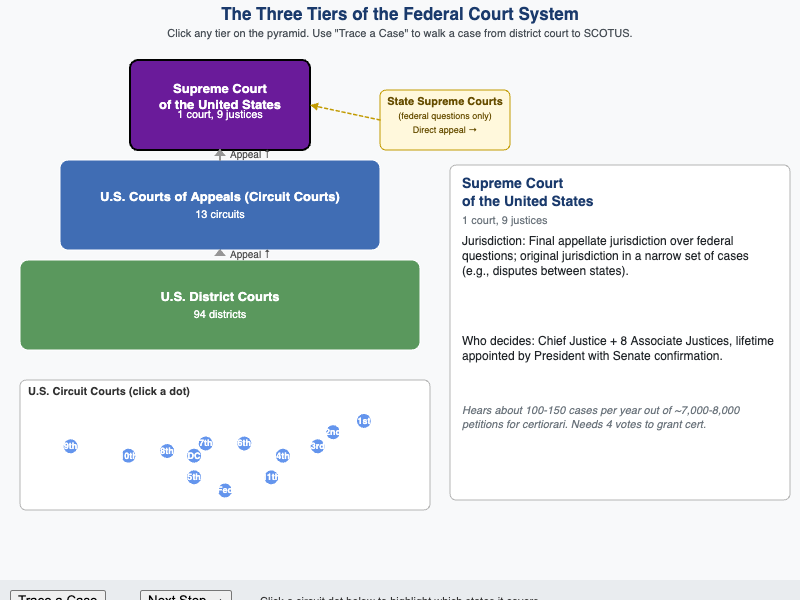

    Identifies the three tiers of the federal court system and explains the jurisdiction each tier exercises and how cases move between levels.

-   **[Trust In Government Causal Loop Diagram](./trust-in-government/index.md)**

    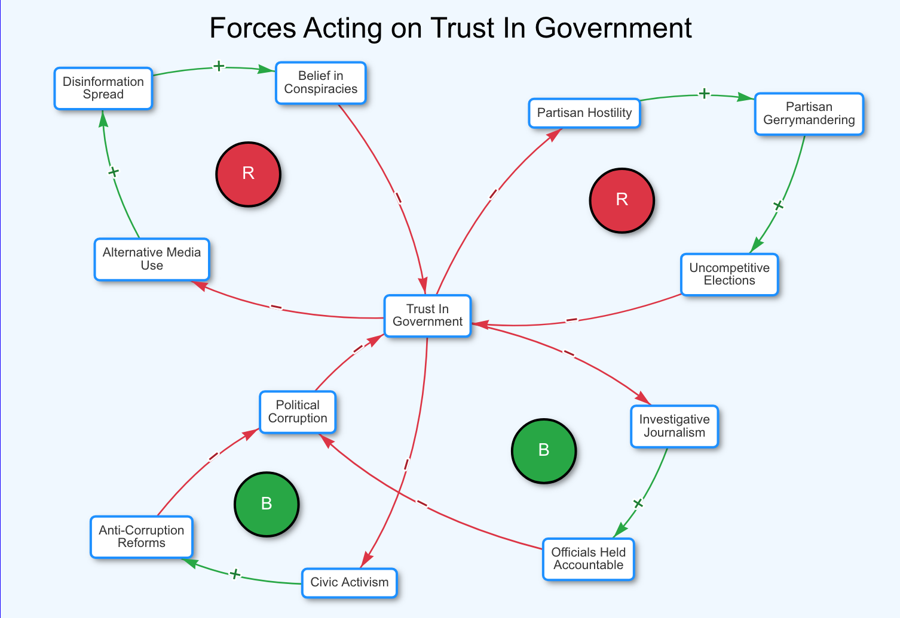

    Systems-thinking view of the forces eroding and restoring trust in the U.S. government across four reinforcing and balancing feedback loops.

-   **[Understanding Polling — Margin of Error](./polling-margin-of-error/index.md)**

    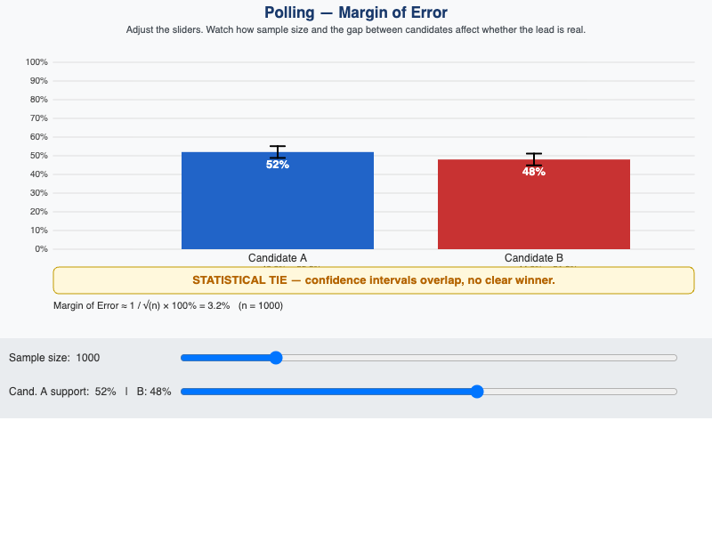

    Interactive simulation for interpreting polling data including margin of error to distinguish statistically significant differences from statistical ties.

